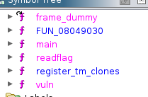
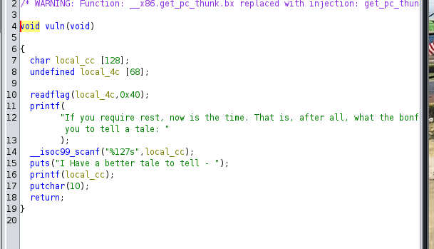
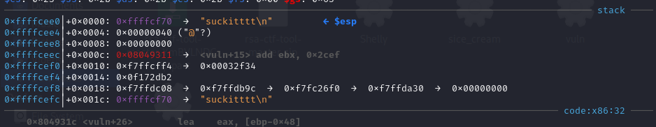

## Preliminary Analysis on the provided 'Leaky' binary

#### Running Checksec and File on the given binary

- The binary has 3 protections disabled
  - **Partial RELRO aka Relocation ReadOnly**
    - Understanding RELRO is a little confusing as it deals with 2 main concepts
      - Global Offset Table
        - This is used to dynamically resolve the functions located in shared libs
      - Procedure Linkage Table
        - Contains the x86 instructions that point directly to the GOT
      - When partial, the GOT is read-only but the PLT can be modified which is the case in the provided binary
  - **No PIE (Position-Independent Code)**
    - This means that the locations where the binary and its dependencies are loaded into memory are always randomized. When disabled and used along with a kernel that has no ASLR (Address Space Layout Randomization). We can safely use the stack and memory function offsets we calculate during dynamic analysis
  - **No stack canaries**
    - Canaries are used to monitor the stack for buffer overflows

## Observing the vuln function

- Performing static analysis via your reverser of choice i.e ghidra/IDA/GDB we can obeserve a format-string vuln in the printf statement inside the vuln function
  - 
  - Vuln noted in line 14, use of printf is generally encouraged with a %s modifier to ensure strings are not treated as commands
  - Note that the readflag function is called before our vuln function
    - This means that the value of the flag is on the stack and we can either spam %x to pop off values in the stack and copy the output for decoding or we can specify which location to pop off via a little bit of dynamic analysis

## Using GDB and GEF

- Disassemble the binary in gdb and analyze the vuln function
  - 
- Set a breakpoint at offset 0x08049325 and then view the stack after the readflag call
  - 
- Offset to pop off is 0x18h (24 in decimal). NOTE:: This exact number varies from OS to OS. In my experience the offset value you get in kali is 24 while in ubuntu it is 20. Overall the logic is the exact same irrespective of the OS in question
  - 
- Sending %24$s should print off our flag from the stack
  - 
