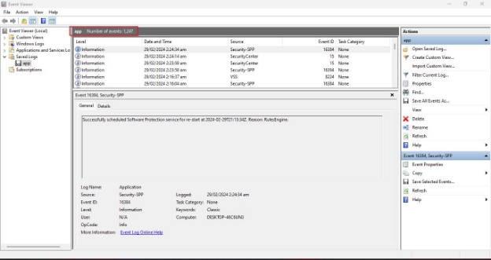
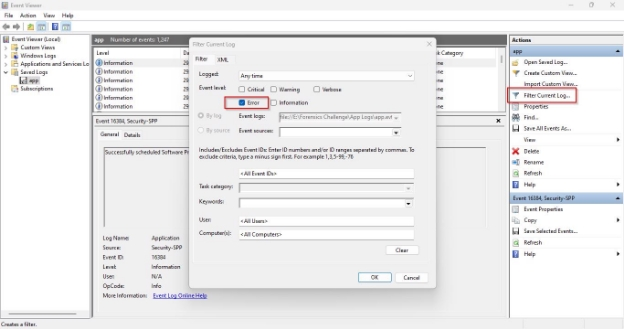
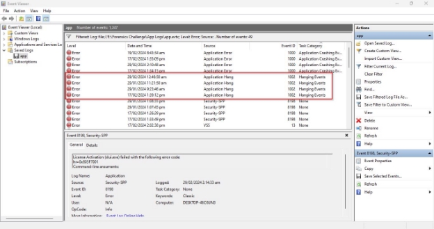
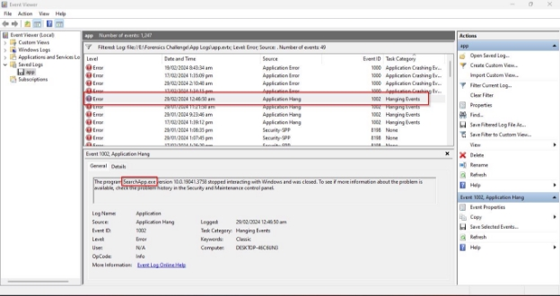
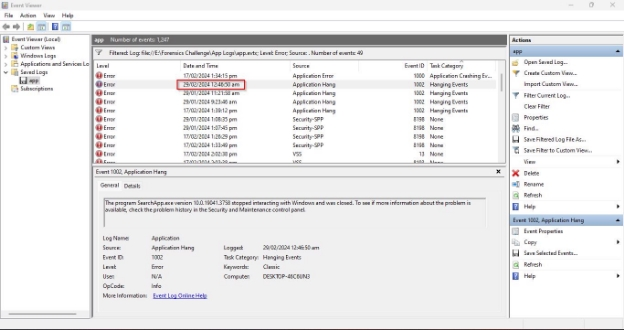
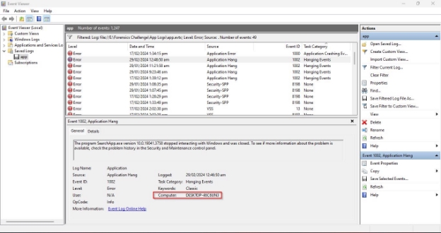

**Challenge Name: Lag Alchemist**

**Points: 50** 

**Description:** 

Filter the reason of turtle's patience. 

Questions: 

1. How many times computer hang? 

2. Which application causes the hanging? 

3. What was the recent hanging date? (Format: 00/00/0000) 

4. Computer Name? 

**Flag Format --->CSL{0\_name.exe\_DD/MM/YYYY\_????????????}**

**Solution:** 

We are given an app log with 1247 entries. 

In Q1, we must see how much time computers hang. For this apply error filter. 

There is total 4 hanging events: 

In Q2, we must see which application causes hanging. Click the event, you can see the description in which app is mentioned: 

SearchApp.exe 

In Q3, we must give the recent hanging date.  

Date: 29/02/2024 

In Q4, we must give the Computer Name which is mentioned in the bottom of event: 

Computer Name: DESKTOP-46C6UN3 

**Flag:** CSL{4\_SearchApp.exe\_29/02/2024\_DESKTOP-46C6UN3} 
