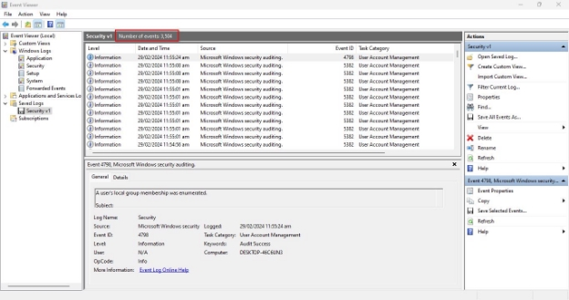
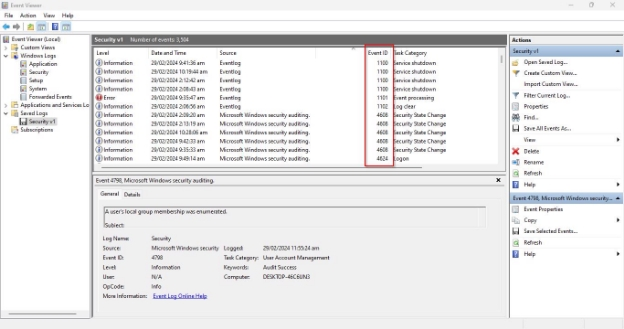
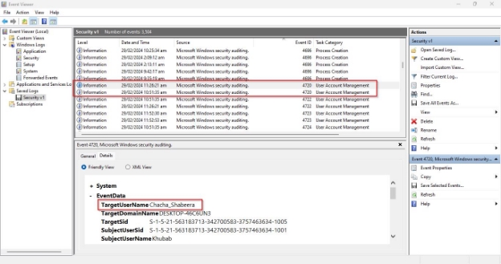
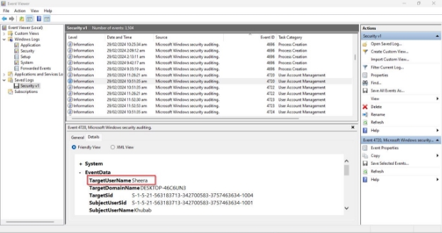
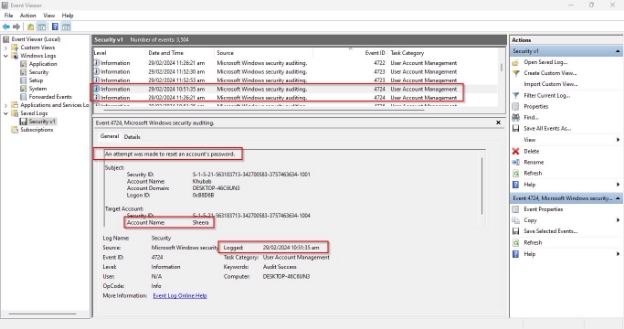
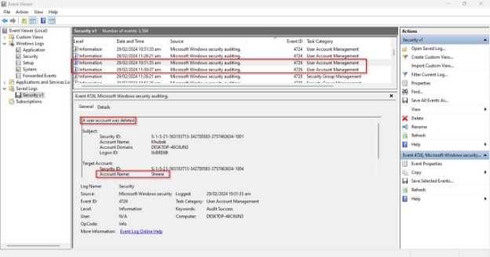
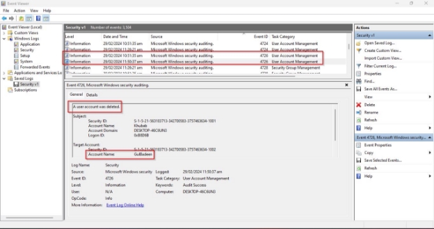
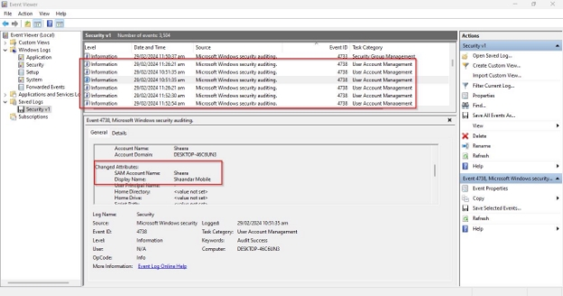

Challenge Name: LogQuest 

Description: 
Unlock the truth. Questions: 

1. Name the accounts that were created? 
1. There was an attempt was made to reset an account's password for Sheera. What was the time? (Format: 00:00:00am) 
1. Name the two accounts that were deleted? 
1. What was the display Name of Sheera Account? 
1. How many overall users present in the system include deleted users? 

Solution: 

We were provided with a security event log file. There are total of 3504 events. 

Sort the events by event id: 

For Q1 to find accounts, there is a specific event id 4720 which is related to user account creation. There are two total events in the file: 

Usernames:  

1. Chacha\_Shabeera 
1. Sheera 

For Q2 to find reset password time about Sheera account, there is event id of 4724 which is generated when someone tries to reset account password. There are two total events related to this.  

Time: 29/02/2024 10:51:35 am 

For Q3, we must find deleted account names; there is an event id 4726 for this purpose. There is total two events related to accounts deletion: 

Names: 

1. Sheera 
1. GulBadeen 

For Q4, we must find the name of Sheera account, there is event id 4738 which is created when user account was changed. There are 6 total events in which there is a name of Sheera account: 

Name: Shaandar Mobile 

For Q5, we must list the total user numbers, including deleted ones. Based on the above logs, there are 3 users from above and one user who performed all the actions.  
Answer: 4 

Flag:

CSL{Chacha\_Shabeera\_Sheera\_10:51:35am\_Sheera\_GulBadeen\_Shaan darMobile\_4} 
