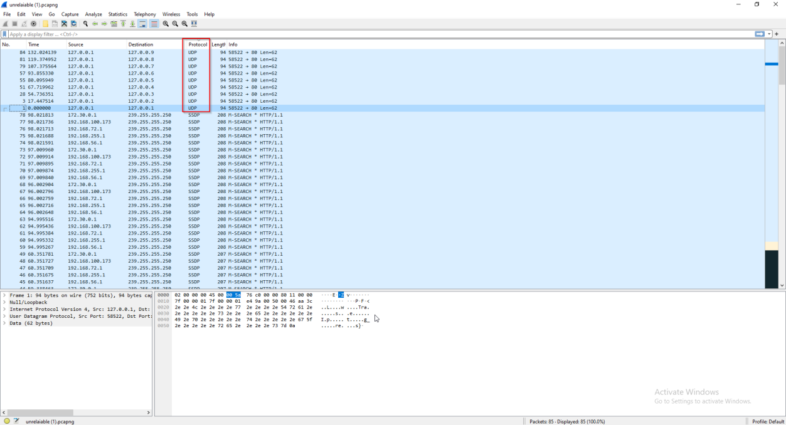
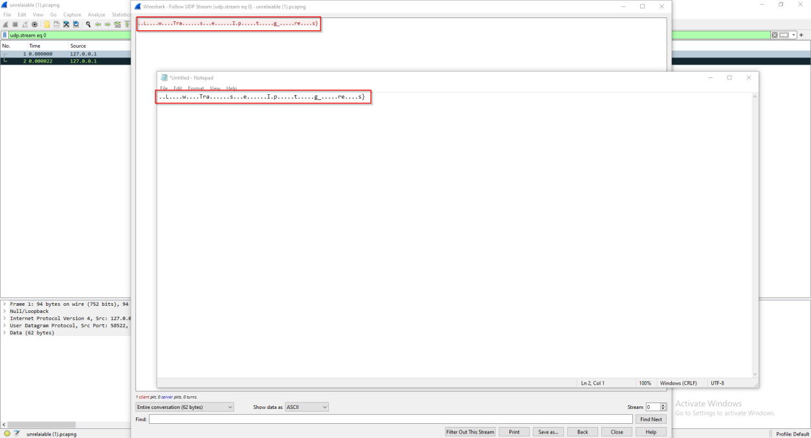
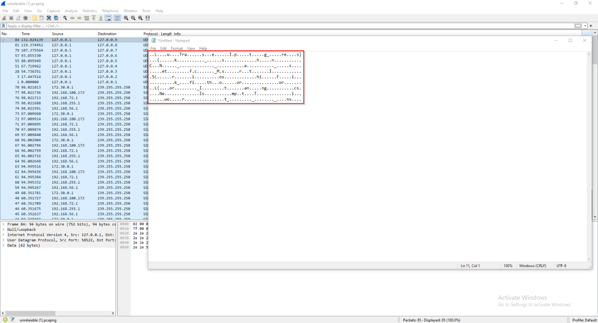
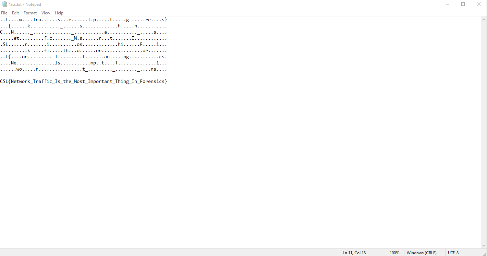

From the name it’s hinted toward the unreliability which in network would be UDP protocol.

First use some filter or press the protocol tab button to get all the packets together.

Opening the packets we can see that some characters are written in there. A good habit in CTF is to
copy all the information found so you don’t have trace back your steps again and again.

Once all the data from the packets is extracted you can see that some meaningful word is made if you trace all lines from top to bottom.

Which lead us to our flag

Flag: CSL{Network_Trafic_Is_the_Most_Important_Thing_In_Forensics}
