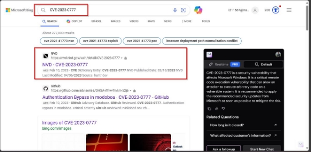
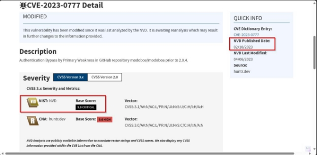
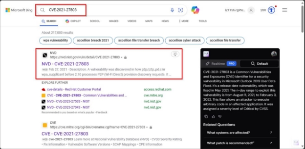
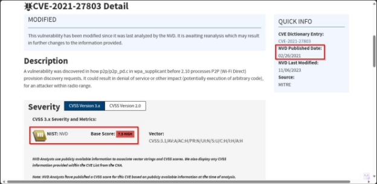

**Challenge Name: 3xploits** 

**Points: 25** 

**Description:** 

You have given a CVE: 

- CVE-2023-0777 
- CVE-2021-27803 

Questions: 

1. Provide its Overall Base Score according to NIST? 
1. What is NVD Published Date? 

**Flag Format------> CSL{0.0\_MM/DD/YYYY\_0.0\_MM/DD/YYYY}** 

**Solution:** 

We have been given two CVEs in which we must find its overall base score and its NVD published date. 

**First CVE:**  

**Given CVE:** CVE-2023-0777   

**Steps:** 

Go to Bing and search for this CVE. We found first website of NVD for this CVE: 

On the front of this website, we found out its base score and its published date: Base Score: 9.8 

Published Date: 02/10/2023 

**Second CVE:** 

Given CVE: CVE-2021-27803   

Again, go to Bing and search for this CVE. You find first website of NVD: 

On the front of website, we found its base score and its published date: Base Score: 7.5 

Published Date: 02/26/2021 

**Flag:** 

CSL{9.8\_02/10/2023\_7.5\_02/26/2021}
