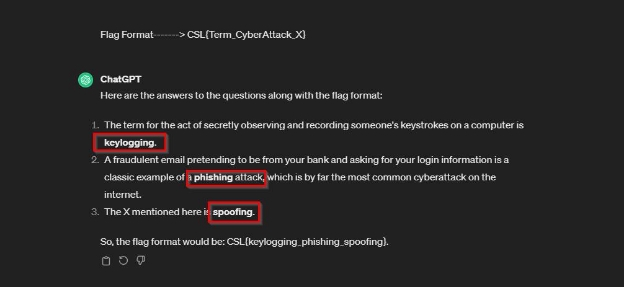

**Challenge Name: Att@cks**

**Points: 25** 

**Description:** 

There is no relation between these questions. Each question mantain a seprate scenario:

Questions: 

1. What is the term for the act of secretly observing and recording someone's keystrokes on a computer? 
1. A fraudulent email pretending to be from your bank and asking for your login information is a classic example of what kind of simple cyberattack, which is by far the most common cyberattack on the internet?
1. What is the X mentioning here? 

Email X – where an attacker forges the sending address of an email.  

IP address X – where an attacker alters the source IP address in a network packet to hide their identity. 

Biometric X -where an attacker produces a fake biometric sample to pose as another user

MAC X – where an attacker modifies the Media Access Control (MAC) address of their network interface to pose as a valid user on a network. 

**Flag Format-------> CSL{Term\_CyberAttack\_X}** 

**Solutions:** 

To save the time in CTF, we give these questions direct to ChatGPT to solve this:

**Flag:** CSL{Keylogging\_Phishing\_Spoofing}  
