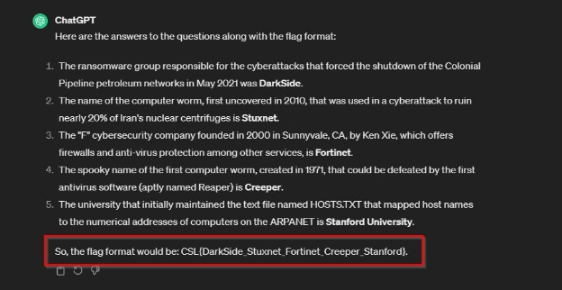

**Challenge Name: H@ck3rs Knowl3dg3 I**
 
**Points: 25** 

**Description:** 

1. In May 2021, the FBI declared that what ransomware group was responsible for the cyberattacks that forced the shutdown of the Colonial Pipeline petroleum networks?

2. What is the name of the computer worm, which was first uncovered in 2010, that was used in a cyberattack to ruin 

nearly 20% of Iran's nuclear centrifuges, setting their program back years? 

3. What “F” cybersecurity company, which offers firewalls and anti-virus protection among other services, was founded in 2000 in Sunnyvale, CA by Ken Xie? Their logo is the letter “O” formed by red blocks. 

4. What was the spooky name of the first computer worm, created in 1971, that could be defeated by the first antivirus software (aptly named Reaper)? 

5. What university initially maintained the text file named HOSTS.TXT that mapped host names to the numerical addresses of computers on the ARPANET? 

**Flag Format------> CSL{Name\_Name\_Name\_Name\_Name}** 

**Solution:** 

To answers these questions and save time in CTF. Solved these questions by ChatGPT:

**Flag:** CSL{Darkside\_Stuxnet\_Fortinet\_Creeper\_Stanford} 
