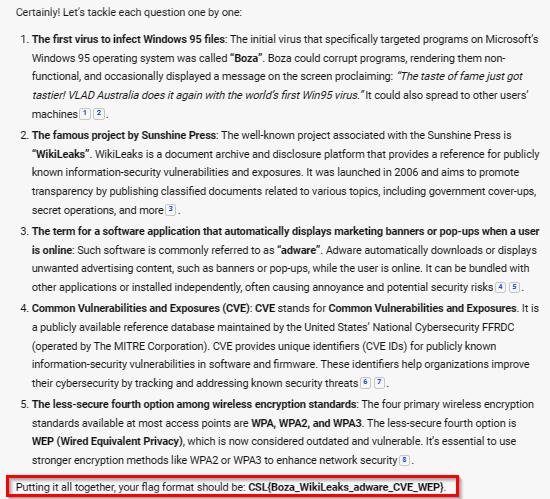

**Challenge Name: H@ck3rs Knowl3dg3 II**
 
**Points: 25** 

**Description:** 

1. The first virus to infect Windows 95 files is? 

2. What is the famous project by Sunshine Press?

3. What term is given to a software application that automatically downloads or displays marketing banners or pop-ups when a user is online? 

4. Common \_\_\_\_\_\_ and Exposures (CVE) is a publicly available reference database of known security threats that is maintained by the United States' National Cybersecurity FFRDC. 

5. The four principle wireless encryption standards available at most access points are WPA, WPA2, WPA3, and which less - secure fourth option? 

**Flag Format--------> CSL{Name\_Name\_Name\_Name\_Name}**
 
**Solution:** 

To save time in CTF, I solved by this Copilot: 

Remember, in question 4 we have to fill in the blank in which vulnerability is required.

**Flag:** CSL{Boza\_Wikileaks\_Adware\_Vulnerabilities\_WEP}  
