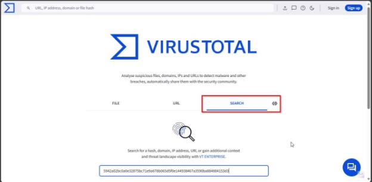
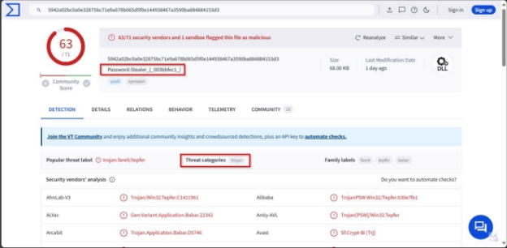
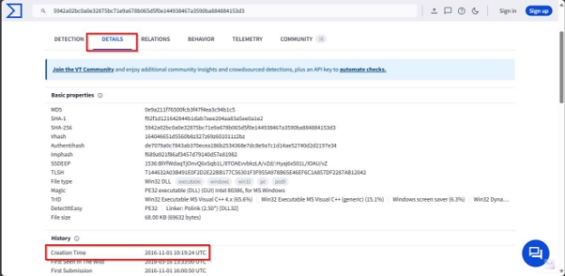
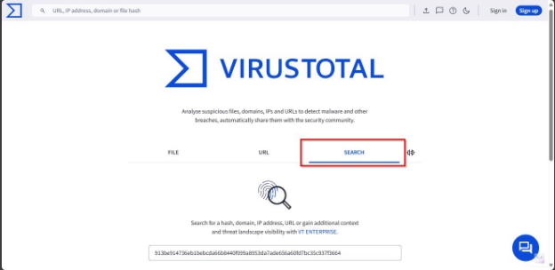
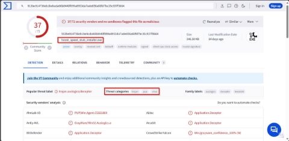
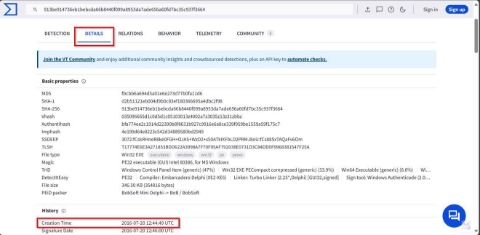

**Challenge Name: M4lw4re Points: 25** 

**Description:** 

You have given a Malware hash. Provide its name, creation time and its threat category? 

5942a02bc0a0e32875bc71e9a678b065d5f0e144938467a3590ba88 4884153d3 

913be914736eb1bebcda66b8440f099a8953da7ade656a60fd7bc35 c937f3664 

**Flag Format-------> CSL{Name\_YYYY-MM- DD\_Category\_Name\_YYYY-MM-DD\_Category}** 

**Solution:** 

There are two hashes given of a malware. We have to give its name, creation time and its threat category: 

**First Malware:** 

**Given Hash:** 5942a02bc0a0e32875bc71e9a678b065d5f0e144938467a3590ba884884153d3  

**Steps:** 

Go to[ VirusTotal ](https://virustotal.com/)website. Search for this malware hash:

It's found out its all-related data. In the front page it shows its name and its threat category: Name: Password-Stealer\_(\_003bbfec1\_) 

Threat Category: Trojan 

For the creation time, go under the details tab. It shows the creation time of malware: Creation time: 2016-11-01 10:19:24 UTC 

**Second Malware:** 

**Given Hash:** 913be914736eb1bebcda66b8440f099a8953da7ade656a60fd7bc35c937f3664  

Steps: 

Again, go to the[ VirusTotal ](https://virustotal.com/)website and search for malware hash:

On the front page, it shows its name and its threat category: Name: boost\_speed\_stub\_installer.exe

Threat Category: Trojan 

On the detail tab it shows its creation time: Creation time: 2016-07-20 12:44:49 UTC 

**Flag:** 

CSL{Password-Stealer\_(\_003bbfec1\_)\_2016-11- 01\_Trojan\_boost\_speed\_stub\_installer.exe\_2016-07-20\_Trojan}, 
